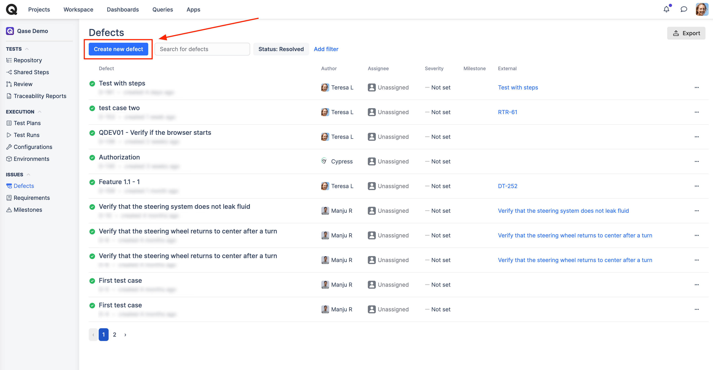
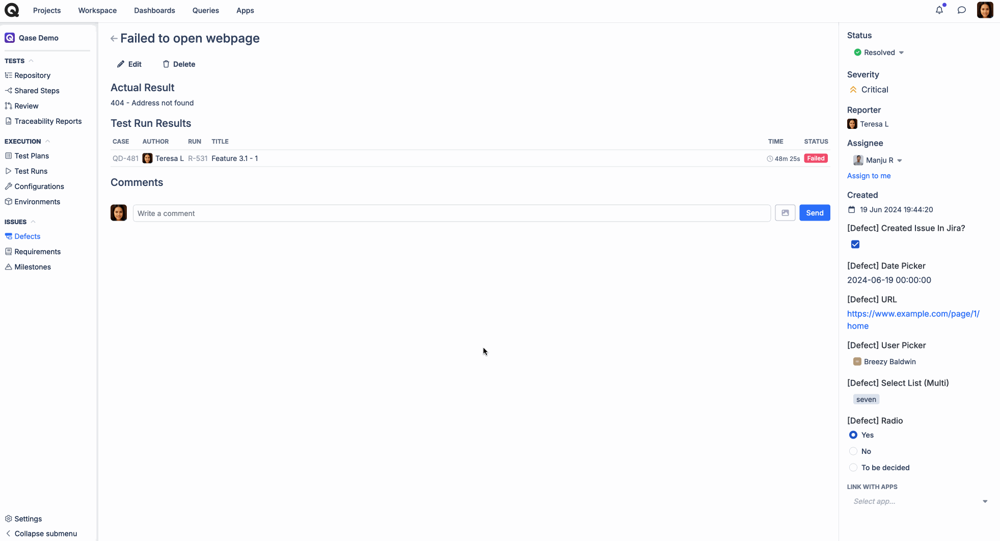
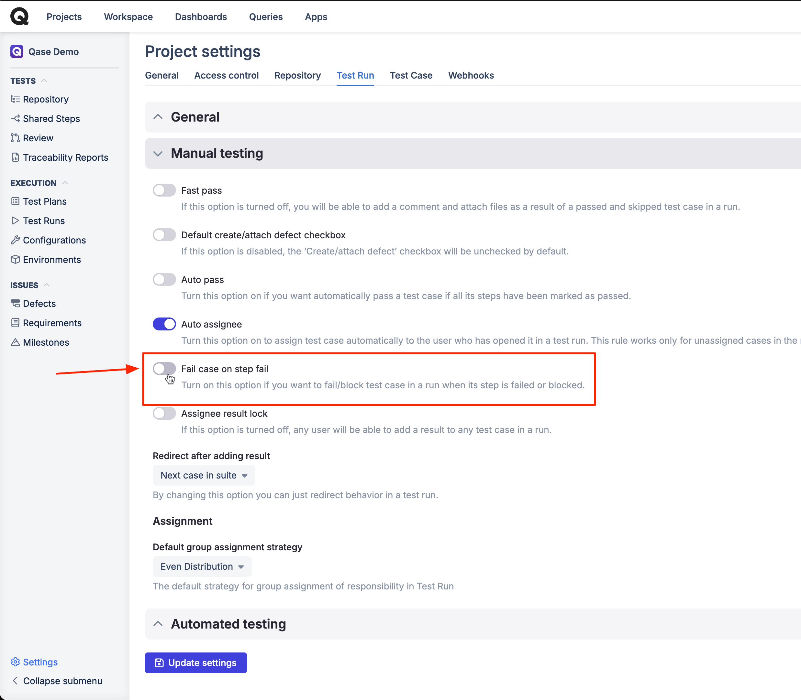
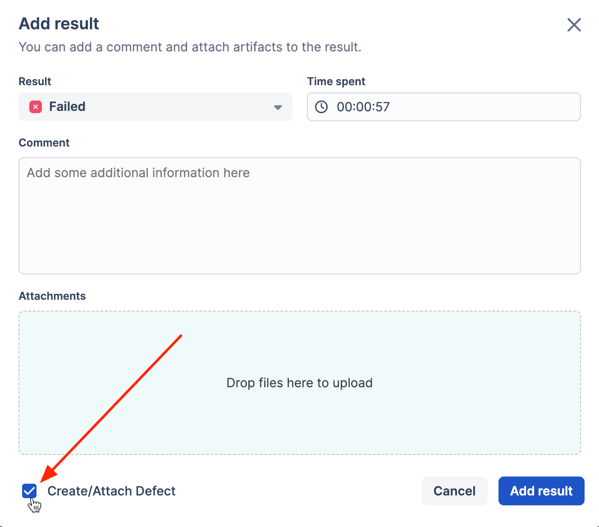
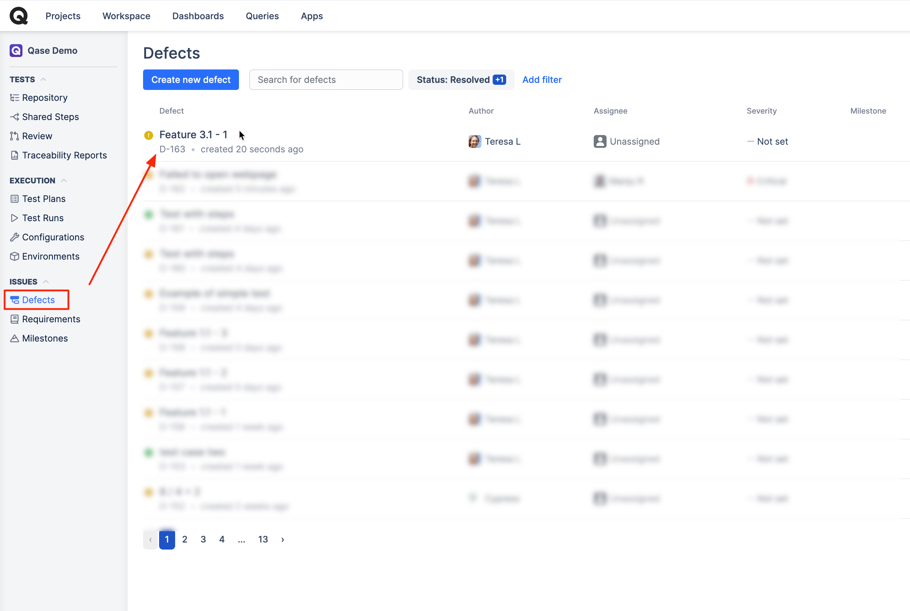
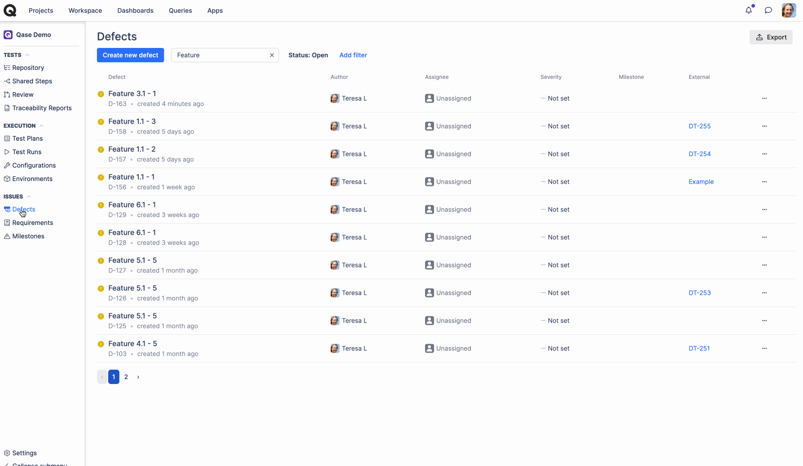
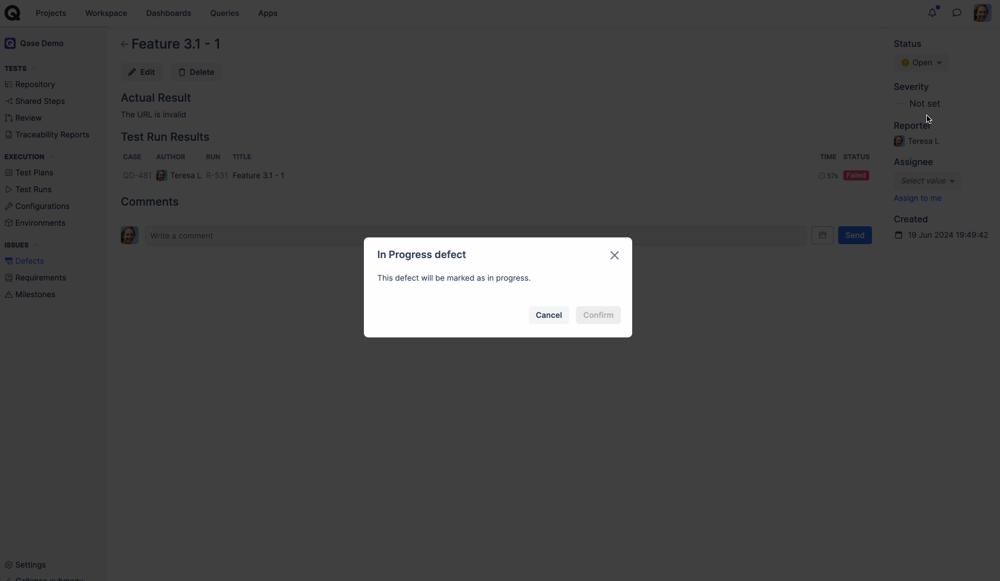
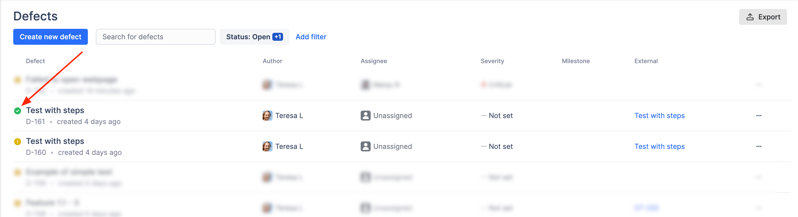

# Defects

### What are defects?

Defects in Qase, can help you keep track of the issues you've discovered, during the Test runs.



### Creating Defects

In Qase, there are two ways to create a defect:

1. You can create one from the defects section for any issue that is not necessarily connected to a particular test case or test run.
2. Another option is to file a defect upon failing a test case during a test run.

### Option 1: Filing a Defect from the _Defects_ section of the workspace. 

To do that, hit _Create New Defect,_ and add all necessary details - Defect Title, Actual Result, Severity, fill out any [custom fields](../../administration/workspace-management/custom-fields.md) applicable to Defects, and optionally add attachments:

<figure><figcaption></figcaption></figure>

<figure><figcaption></figcaption></figure>

Such a defect would not have any reference to a [Test case](../get-started-with-the-qase-platform/test-cases/) or a [Test Run](../get-started-with-the-qase-platform/create-a-test-run/), since it has not been filed from any.

However, such a defect - just like a Defect filed during a Test Run - can be marked as "In Progress" (and then, consecutively, "Resolved") or Invalidated.

Additionally, the defect can also be linked with a external issue, like a Jira ticket.

<figure><figcaption></figcaption></figure>

At the same time, any defects you will be filing during test runs later can be tied to an existing defect you created manually:

<figure><figcaption></figcaption></figure>

This can be helpful when you are aware of the issues beforehand, even before performing a single test run, and want to document them in advance.

### Option 2: Filing a Defect when performing a test run 

First off, when setting up your Project, keep in mind the "Fail case on step fail" setting:

<figure><figcaption></figcaption></figure>

If this option is -

* Enabled - failing any single step in a case during a run will automatically fail an entire test case, and you will be suggested to file a new Defect.
* Disabled - failing a single step in a case will not result in failing an entire test case, and you will be able to continue with other steps in the run while being suggested to create a Defect only if you fail an entire test case.

So, how do we create a Defect during a test run?

* Mark a Test Case as "Failed", or add any other _Negative_ Result:

<figure><figcaption></figcaption></figure>

* You will be prompted to a Run result window, where you can file additional comment, record how much time was spent on a test case execution, attach files, and create/attach defect:

<figure><figcaption></figcaption></figure>

* With the checkbox checked, you will be next prompted to fill out other remaining Defect properties, including any custom fields you created for it.\
  ​\
  You will be able to select whether you want to create a new Defect or attach an existing one to the issue you've found; change its title, severity, and custom fields' values; opt to send a connected issue to other [integrated third-party software systems](https://help.qase.io/en/collections/3564516-apps):

<figure><figcaption></figcaption></figure>

Now a new Defect will be created from a test run result - you can find it saved under the "Defects" section and the “Defects” tab of your test run:

<figure><figcaption></figcaption></figure>

<figure><figcaption></figcaption></figure>

NB: Defects viewed in a test run will show you only defects filed in that test run, but under the “Defects” section, you will find all defects filed in a project.

## Managing Defects 

***

In the Defects section, you can search and filter all the defects filed in your project:

<figure><figcaption></figcaption></figure>

Clicking on the Title of your new Defect will provide you with more details about this Defect, such as which Test Run it was performed in, which Test Case it pertains to, who reported this Defect - and other important data:

<figure><figcaption></figcaption></figure>

After a Defect has been created, you can:

* Add a connected issue to other [integrated third-party software systems](https://help.qase.io/en/collections/3564516-apps). Here we have an example to connect a Jira issue:

<figure><figcaption></figcaption></figure>

* You can also change its status by marking it "In Progress" once you've started working on it

<figure><figcaption></figcaption></figure>

* After the Defect has been marked as "In Progress", you can then mark it as "Resolved" once the issue has been fixed (at this stage, you can still invalidate it):

<figure><figcaption></figcaption></figure>

* Invalidate it by updating its status to "Invalid", if, for example, an issue that's been filed is not really an issue:

<figure><figcaption></figcaption></figure>

* Resolving a Defect will mark it as resolved, which will be made visible with a green icon to the left of a Defect's title. You can also apply filters in the Defects list view to look up specific Defects by parameters:

<figure><figcaption></figcaption></figure>

You can introduce changes to a Defect as well by hitting the Edit button.

Editing a Defect will take you to another screen, where you can change the Defect's Title, enter the Actual Result, add an attachment, etc., and update a defect once ready:

<figure><figcaption></figcaption></figure>

