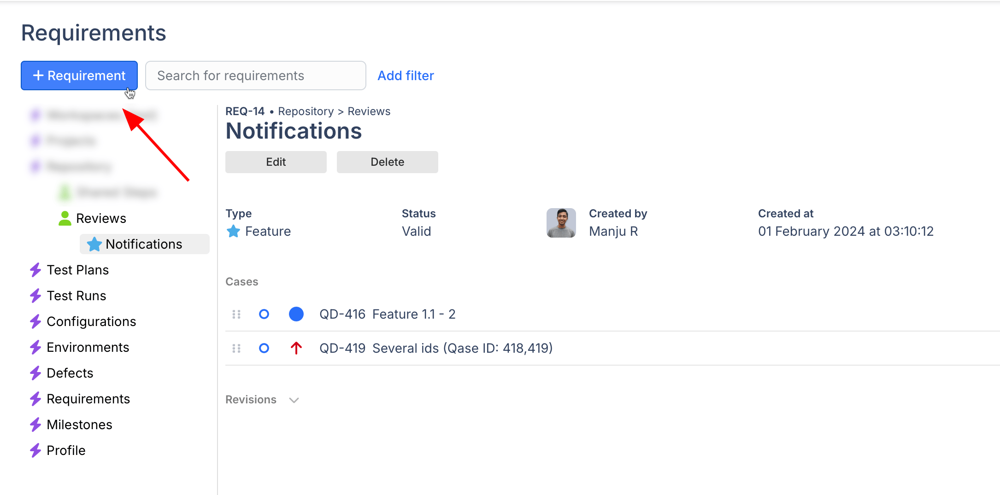
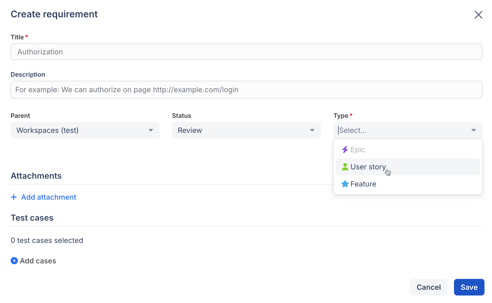
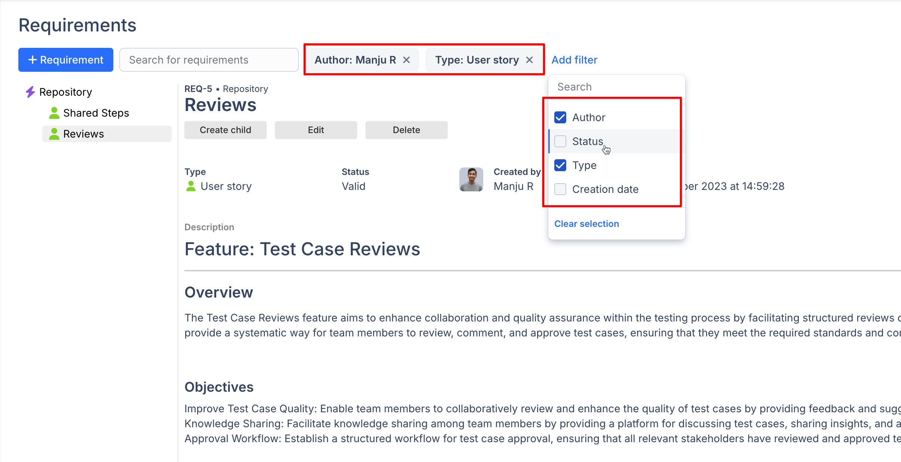

# Requirements


Requirements are available in [Startup](../../administration/subscriptions/startup-plan.md), [Business](../../administration/subscriptions/business-plan.md) and [Enterprise](../../administration/subscriptions/enterprise-plan.md) subscriptions.


### What are requirements in software testing?

Requirements are a vital part of the test management paradigm. They allow you to track whether your product is what's expected of it and keep your testing efforts in accordance with the requirements documented earlier.



### How to create a requirement?

In Qase, you can manage product requirements in the dedicated "Requirements" section.

<figure><figcaption></figcaption></figure>

To create a new requirement, hit the "+Requirement".

<figure><figcaption></figcaption></figure>

A requirement has several properties:

<figure><figcaption></figcaption></figure>

* _Title_
* _Description_: optional, add any extra information about your requirement here.
* _Parent_: here you can define whether a requirement should be a sub-requirement of another higher-level requirement. If there are no requirements created yet, the only option available will be "Root".
* _Status_: you can choose from several Requirement statuses - Valid, Draft, Review, Rework, Finish, Implemented, Not Testable, Obsolete.
* _Type_: a requirement can be either an Epic, a User Story, or a Feature.
* _Attachments_ can be provided for additional context of a requirement.
* Next, attach the [Test Cases](../get-started-with-the-qase-platform/test-cases/) that will be covering your requirement:

<figure><figcaption></figcaption></figure>

### Requirement's details

Once a requirement has been created, you can see its details in the section, create a "child" (or a sub-requirement), edit or delete it, and navigate to test cases that cover this requirement by clicking test case title:

<figure><figcaption></figcaption></figure>

Requirements section also allows you to look up items by title or description using the search box, or filter out specific requirements by a certain parameter (author, status, type, or creation date):

<figure><figcaption></figcaption></figure>
