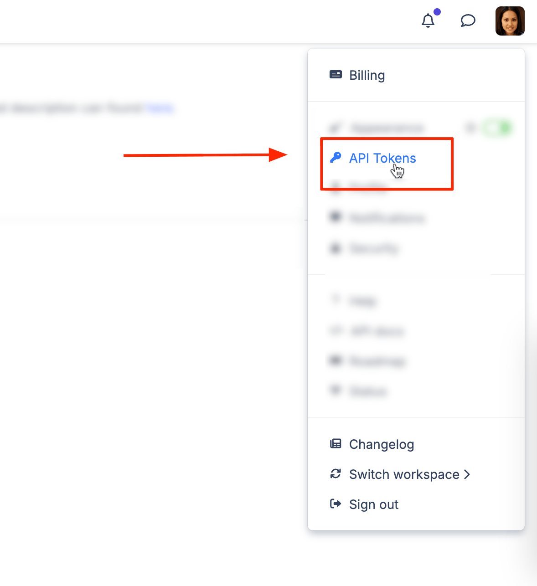
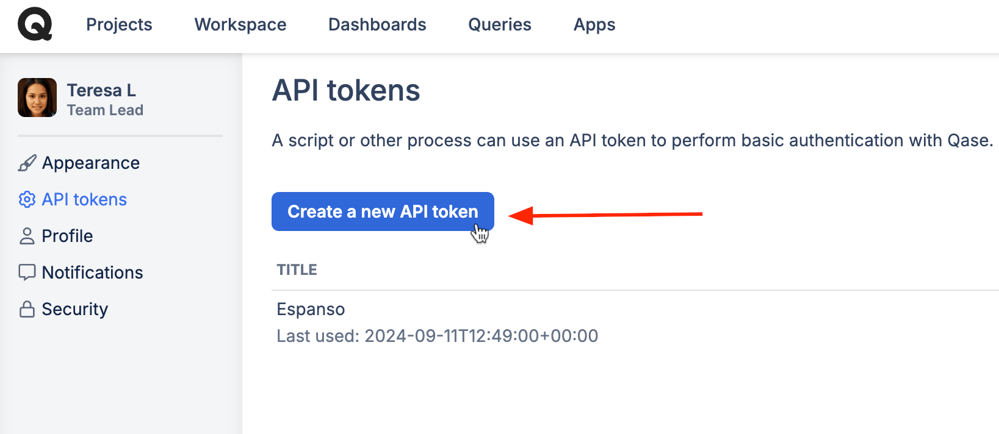
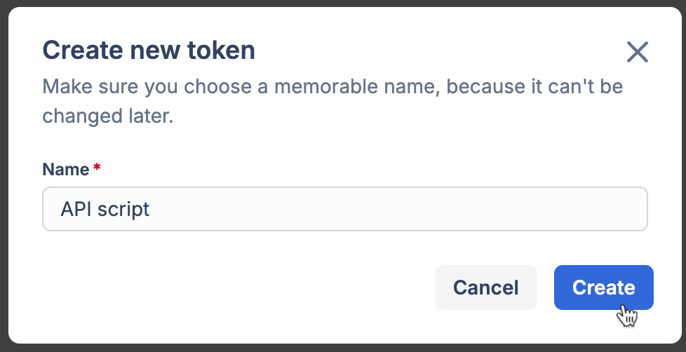

# Qase API

### What can I do with Qase API?

Qase provides API methods that you can utilize to interact with it, set up custom integrations or create your own solutions to submit automated execution results into Qase test runs.

You can refer to full **API documentation** to learn more here: [https://developers.qase.io](https://developers.qase.io/)


Also, you can find a public collection on Postman which contains all available API methods: [https://www.postman.com/qaseio?tab=collections](https://www.postman.com/qaseio?tab=collections)


### What is a token for?

API requests to Qase are authenticated with the auth token. In order to perform actions in your workspace using API, you will need to obtain a token first.

### How to generate an API Token?

Here's how to create an API token:

\
1\. Click your user pic and hit "API Tokens".

<figure><figcaption></figcaption></figure>

2\. Click "Create a new API token" to proceed. You can set up an unlimited number of tokens for your needs.

<figure><figcaption></figcaption></figure>

3\. Give your token a title and hit "Create".

<figure><figcaption></figcaption></figure>

**Note**: after you click the "Create" button, a token will be displayed. Copy the token as it will only be shown once. Otherwise, you will need to create a new token.


**Scope of permissions**: an API token inherits the permissions that a user issuing it has in the workspace. For example, if your [user role](https://help.qase.io/en/articles/5563741-workspace-management-roles) does not allow you to create test runs, you will not be able to create test runs while using Qase UI or by sending an API request.


To discontinue the token, you can "Revoke" it through the three-dot-menu:

<figure><figcaption></figcaption></figure>

\
