# Get started with the Qase platform

Qase helps to manage test cases, track their execution status, and report defects. To get started:

1. Create a project that will contain all artifacts
2. Create a test suite with test cases to store the details of our test
3. Create a test run to define which tests should be executed on a product build and track execution status
4. Create a defect based on the failed result of a test case

## Projects 

***

[Project](general/get-started-with-the-qase-platform/create-a-project.md) is our workspace to keep all parts related to a specific application together. Let’s create a new project -

### To create a project: 

1\. Open[ https://app.qase.io/](https://app.qase.io/) and log in. As a result, the page “Projects” is shown\
​

<figure><figcaption></figcaption></figure>

2\. Click on the button “Create new project”. A popup “Create New Project” is shown. Fill in the name and description. Notice that the field “Project Code” is automatically filled in with the first letters from the project name. You can edit this code if needed.

You can also select who gets access to the project, you can select “Public” if you would like all the users to have access to the Project. Or you can select “Private” and decide which users have access to the Project.

<figure>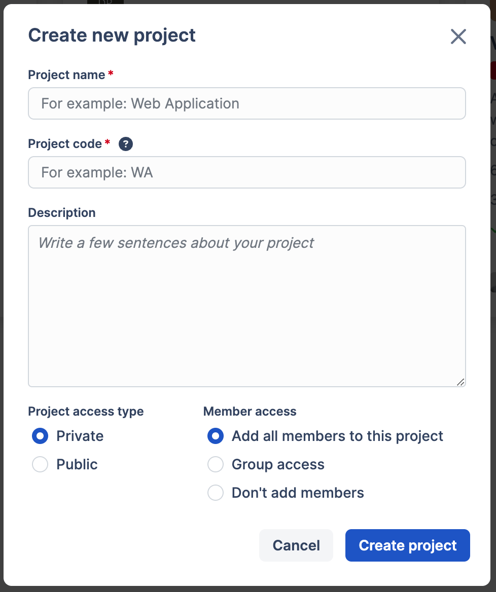<figcaption></figcaption></figure>

3\. Click on the button “Create project”. As a result, the new project is created and its Test Repository page is shown

<figure><figcaption></figcaption></figure>

Congratulations! You have created a project and now it’s time to add some test suites and test cases.

## Test Suites: 

***

[Test Suite](test-management/create-a-test-suite.md) is similar to a folder where we store our test cases organized by sections and subsections. You can create several test suites. For example, Functional and Non-Functional test suites or anything else that should be treated as a separate group of tests.

### To create a test suite: 

1\. On the page “Repository” click on the button “Create new suite” or click on “+ Suite” next to the search bar on the top.

<figure><figcaption></figcaption></figure>

2\. As a result, the popup “Create Suite” is shown. Fill in the suite name and optionally other fields. To create a test suite, click on the button “Create”

<figure><figcaption></figcaption></figure>

3\. As a result, the repository now displays your newly created Suite

<figure>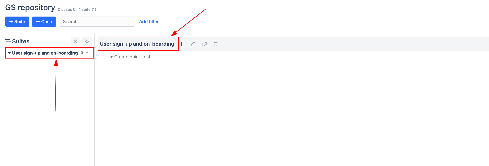<figcaption></figcaption></figure>

Now, we can add test cases, so let’s create our first test case.

## Test Cases 

***

A [test case](general/get-started-with-the-qase-platform/test-cases/) contains all the details about our test. Only the title is enough to create a Quick test case. For a more detailed test case, you can define prerequisites, steps, expected and actual results, etc.

### Quick test case 

1\. On the page, under your suite click on the link “+ Create quick test”

2\. As a result, the cursor will start blinking on the page and you can start typing the title. As soon as you are done, click Enter to save the test case. As a result, a new test case under the suite is shown with ID and a title.

<figure><figcaption></figcaption></figure>

This is the fastest way to add a test case, let’s see how to create a more detailed one.

### Detailed test case 

On the main repository page, click on the button “+ Case”

As a result, a new page “Create test case” is shown. Let’s fill in the most important fields:

<table data-header-hidden><thead><tr><th width="196">Field</th><th></th></tr></thead><tbody><tr><td>Title</td><td>describes what is being tested by the test case</td></tr><tr><td>Status</td><td>denotes the status of the case itself</td></tr><tr><td>Suite</td><td>which suite the test case belongs to</td></tr><tr><td>Priority</td><td>how important is this test case during test execution?</td></tr><tr><td>Severity</td><td>what is the impact on our app’s quality status if this test case fails?</td></tr><tr><td>Is Flaky</td><td>determines if the test case is flaky</td></tr><tr><td>Automation Status</td><td>denotes if the test case is automated, to be automated, or not automated</td></tr><tr><td>Pre-conditions</td><td>the prerequisites for our test</td></tr><tr><td>Steps</td><td>list of actions and expected results after each action</td></tr></tbody></table>

To save a test case click on the button “Save”. As a result, the page “Test repository” is shown with a new test case. Icons with arrows in front show the priority and severity of the test case.

<figure><figcaption></figcaption></figure>

We have added our test cases, let’s execute them in a new test run

## Test Run 

***

[Test Run](general/get-started-with-the-qase-platform/create-a-test-run/) represents a set of test cases to be executed on a specific app build along with the status of their execution. We can have 2 versions of the app: iOS and Android. Both need testing, so for each version, we will perform the same test cases in 2 separate Test Runs.

There are two ways to perform a Test Run: an Express Test Run and a regular Test Run.

### Express Test Run 

It is set up by selecting multiple Test Cases in the repository and hitting the "Run" button; optionally, you can choose which Environment testing should be performed in, and which Milestone a test run will be related to:

<figure><figcaption></figcaption></figure>

### Regular Test Run 

To create a regular test run, navigate to "Test Runs" section, and hit the "Start New Test Run" button

<figure><figcaption></figcaption></figure>

In the configuration form, there are several fields you can fill out

<figure>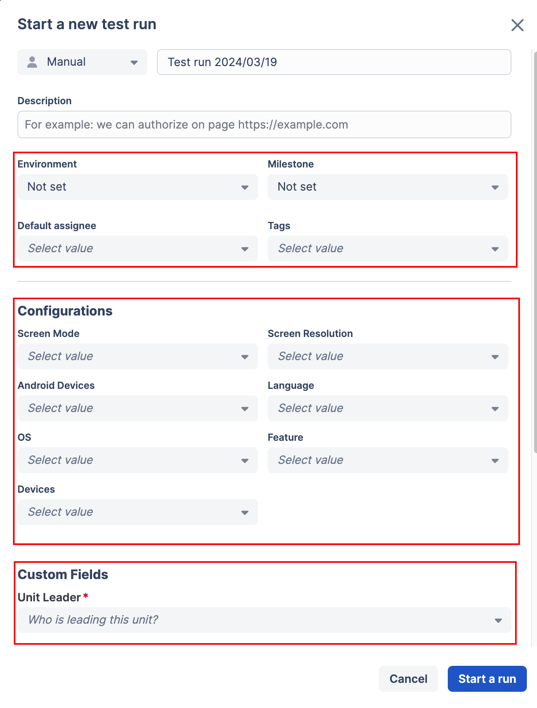<figcaption></figcaption></figure>

<table><thead><tr><th width="145">Field</th><th></th></tr></thead><tbody><tr><td>Run Title</td><td>the name of your test run, this field is pre-filled in with the current date, but you can change it to whichever nomenclature you use.</td></tr><tr><td>Description</td><td>additional details about the test run.</td></tr><tr><td>Environment</td><td>define in which environment should the test run be performed (i.e., testing, staging, production).</td></tr><tr><td>Milestone</td><td>select which Milestone the Test Run is tied to.</td></tr><tr><td>Default Assignee</td><td>
choose whether all Test Cases within the Test Run should be automatically assigned to a specific teammate; 

leaving this field undefined will leave the Test Cases unassigned in the Test Run (you will then need to assign them manually).
</td></tr><tr><td>Tags</td><td>You can assign any of the tags that you have used previously. Or you can create a new tag as well.</td></tr><tr><td>Plan</td><td>choose which Test Plan should be performed in the Test Run</td></tr><tr><td>Test cases</td><td>
if you selected a test plan, all Test Cases contained in this Test Plan would be automatically included in the Test Run. 

However, you can also pick and choose specific test cases from the repository.
</td></tr><tr><td>Integrations</td><td>You can link any of the integrated apps’ issues with your new test run as well.</td></tr></tbody></table>

​

Keep in mind that any settings established for Test Runs in the Project Settings will be applied to your Test Run

<figure>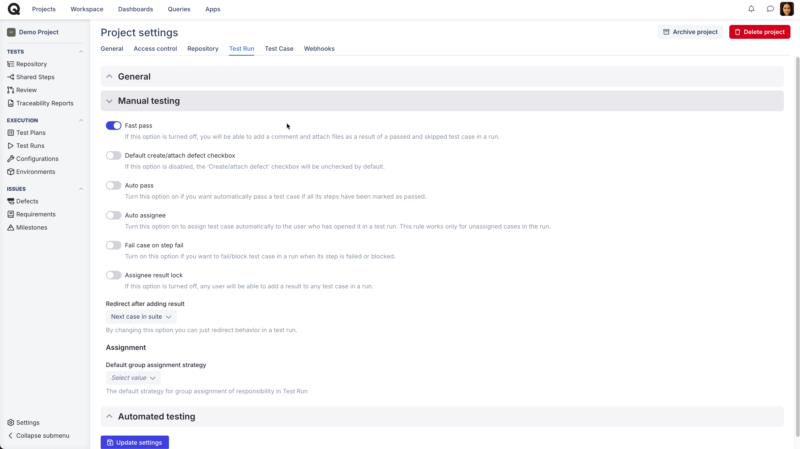<figcaption></figcaption></figure>

With the new Test Run configured, you will now see it in the Test Runs view with some condensed summary of it.

<figure>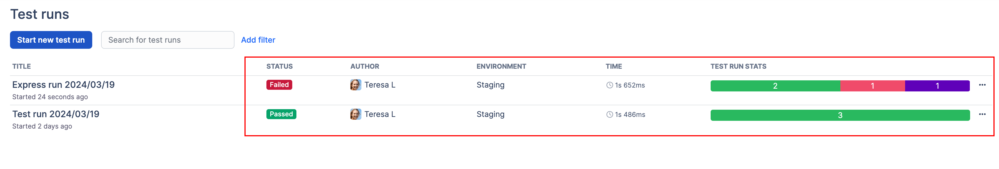<figcaption></figcaption></figure>

* Time will show how much time has been spent so far on performing Test Cases in this run.
* Status will show a summary of test cases per status - how many have passed, how many have been failed, skipped, blocked, invalidated or untested.
* Environment will show the environment of the run which was selected when the run was created.

Test Runs section is filtered to show only Active Runs by default, but you can switch it with the help of the “Add filters” option. You can filter by Status, Assigned to, Environment, Milestone, Tags, Automation status, and Creation date.

<figure>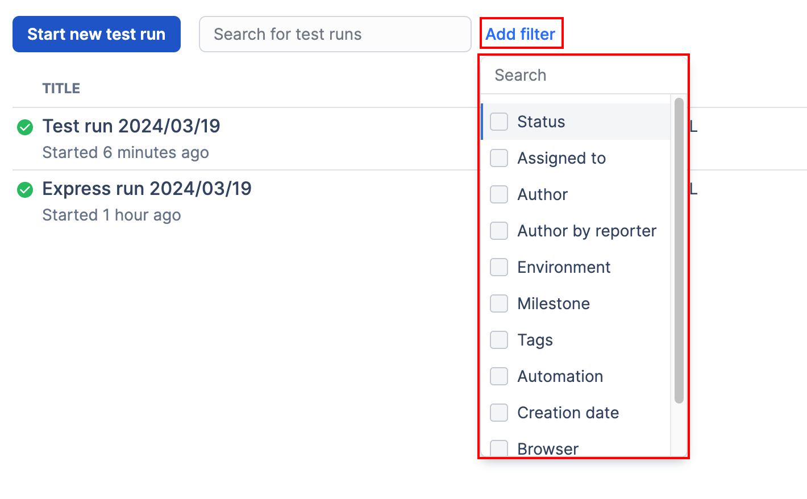<figcaption></figcaption></figure>

## Defects 

***

In this section, let’s see how a new [defect](general/issues/defects.md) can be reported for the failed test case.

In Qase, there are two ways to create a defect: you can create one on the spot, at will, for any issue that is not necessarily connected to a particular test case or test run. Another option is to file a defect upon failing a test case during a run.

**Option 1**:  if you have found an issue or a bug, you can immediately file it as a Defect from the _Defects_ section of the workspace.

To do that, hit _Create New Defect,_ and add all necessary details - Defect Title, Actual Result, Severity, fill out any custom fields applicable to Defects, and optionally add attachments:

<figure>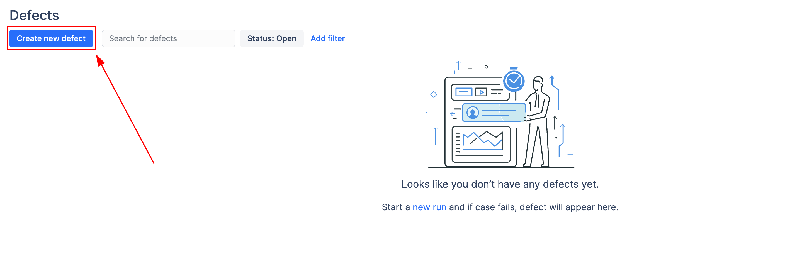<figcaption></figcaption></figure>

<figure><figcaption></figcaption></figure>

Such a defect would not have any reference to a Test Case or a Test Run, since it has not been filed from any. However, such defect - just like a Defect filed during a Test Run - can be marked as "In Progress" (and then, consecutively, Resolved), Invalidated or Edited:

<figure>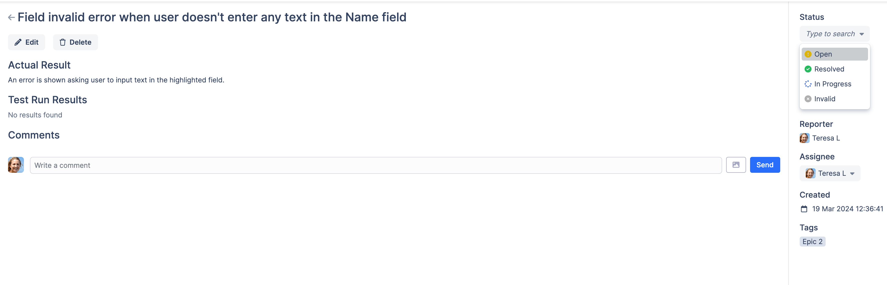<figcaption></figcaption></figure>

<figure>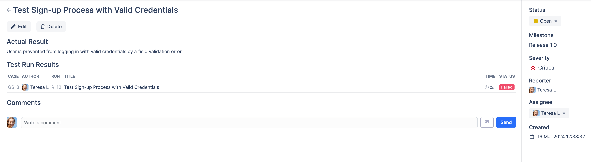<figcaption></figcaption></figure>

At the same time, any defects you will be filing during test runs later can be tied to an existing defect you created manually:

<figure><figcaption></figcaption></figure>

This can be helpful when you are aware of the issues beforehand, even before performing a single test run, and want to document them in advance.

**Option 2**:  When performing a test run, you will surely have some of your test cases fail.

First off, when setting up your Project, keep in mind the "Fail case on step fail" setting:

<figure>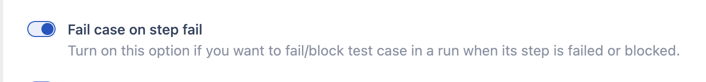<figcaption></figcaption></figure>

* with this setting enabled, failing any single step in a case during a run will automatically fail an entire test case, and you will be suggested to file a new Defect.
* with this setting disabled, failing a single step in a case will not result in failing an entire test case, and you will be able to continue with other steps in the run while being suggested to create a Defect only if you fail an entire test case.

So, how do you create a Defect?

* Mark a Test Case as "Failed":

<figure>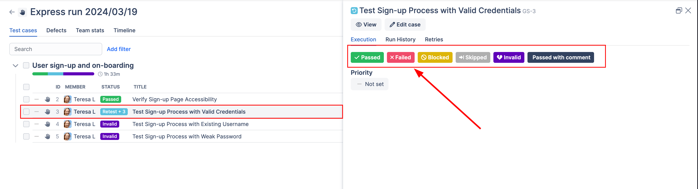<figcaption></figcaption></figure>

*   You will be prompted to a Run result window, where you can file additional comment, record how much time was spent on a test case execution, attach files, and create/attach defect:\

    <figure>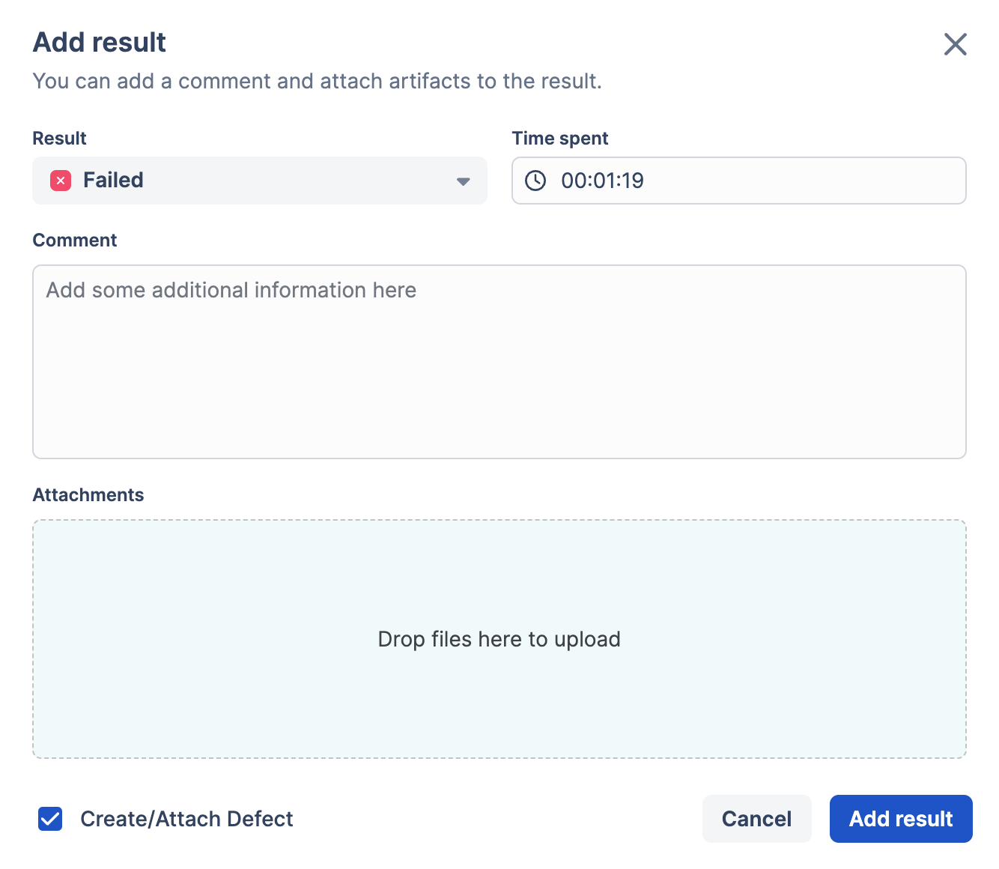<figcaption></figcaption></figure>
*   With the checkbox checked, you will be next prompted to fill out other remaining Defect properties, including any custom fields you created for it. You will be able to select whether you want to create a new Defect, or attach an existing one to the issue you've found; change its title, severity, and custom fields' values; opt to send a connected issue to other integrated third-party software systems:\

    <figure>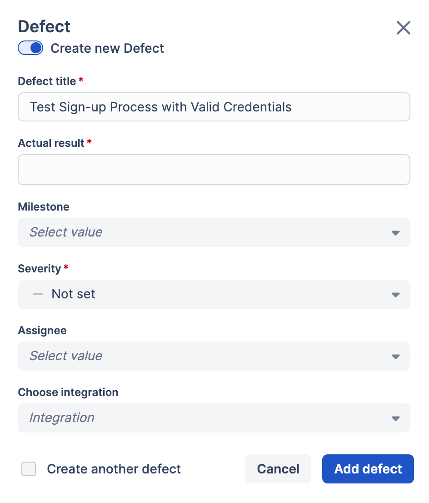<figcaption></figcaption></figure>

Now a new Defect will be created from a test run result - you can find it saved under the "Defects" section and the “Defects” tab of your test run:

<figure>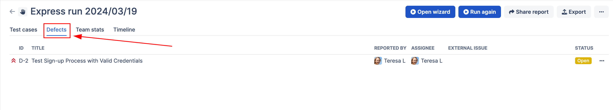<figcaption></figcaption></figure>

<figure>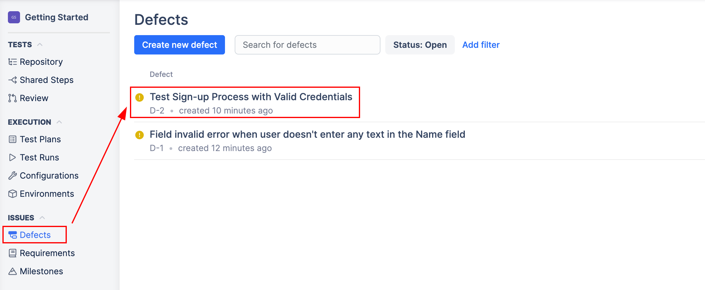<figcaption></figcaption></figure>

Note: Defects viewed in a test run will show you only defects filed in that test run, but under the “Defects” section you will find all defects filed in a project.
