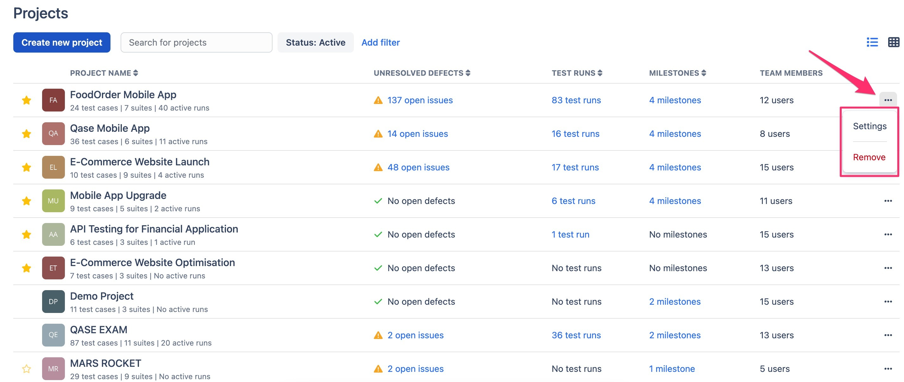
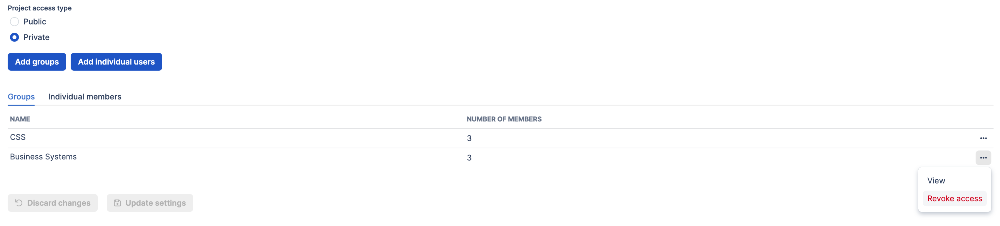
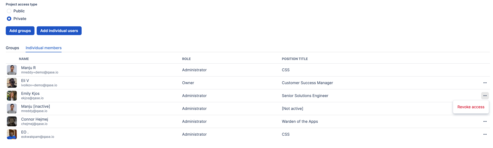
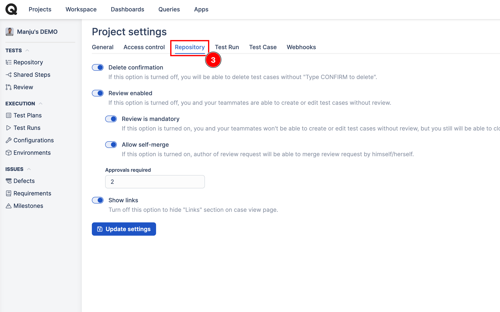
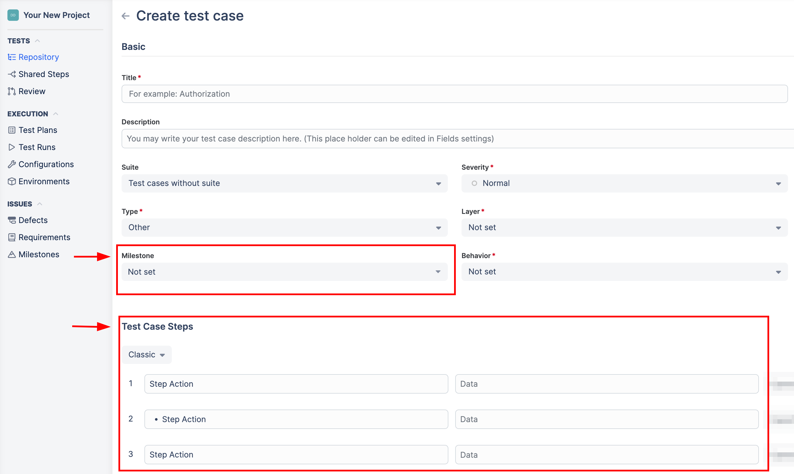
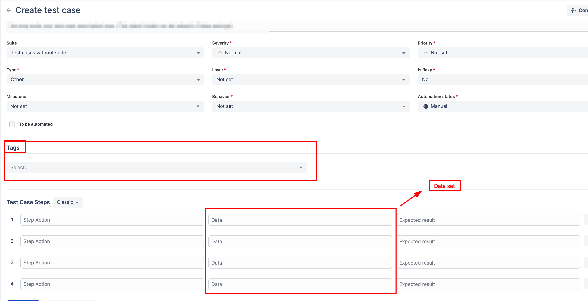
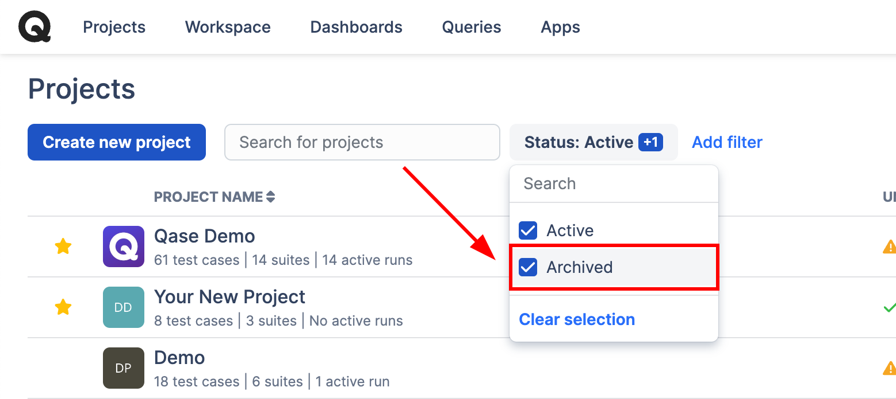

# Projects

**What are projects in software testing?**

_Projects_ allow you to organize your [test suites](https://docs.qase.io/general/get-started-with-the-qase-platform/create-a-test-suite) and [test cases](https://docs.qase.io/general/get-started-with-the-qase-platform/create-a-test-run) by putting them into separate spaces in Qase, thus preventing mixing up test cases related to different areas of development.



For example, if you manage and maintain a web application or website and accompanying mobile applications on iOS and Android, you can create three separate projects for the web application, iOS app, and Android app, respectively. In essence, a project is a container for all test cases pertaining to a specific app, website, etc.

To navigate to the list of your Projects, click "Projects" in the top-left corner of the workspace:

<figure><figcaption></figcaption></figure>

## Project Views 

***

Once in the Projects view, you can choose between two layouts with the controller located in the top-right corner:

* **List view:**

<figure><figcaption></figcaption></figure>

* **Card view:**

<figure><figcaption></figcaption></figure>

In either List or Card view, you can mark a project as a favorite by clicking on the star icon while hovering over the left side of the project title in the list view and on the right side of the title on the card view. Marking a project as a favorite changes the order of appearance of the project. All projects marked as favorites appear above the other projects.

**List view:**

<figure><figcaption></figcaption></figure>

**Card view:**

<figure><figcaption></figcaption></figure>

Additionally, in either of the views, you can also find the summary of each project:

* Unresolved defects that were filed during test runs in a project
* Number of test runs performed for the test cases belonging to a project
* Milestones related to a project
* Number of team members who have access to a project

List view features **Menu** icon where you can:

* edit Project settings (which can also be filled in when you create a new project)
* delete a project

<figure><figcaption></figcaption></figure>

## Creating a new project 

***

Once you are ready to start a new project, hit the "Create New Project" button:

<figure><figcaption></figcaption></figure>

Next, you will be prompted to fill out Project settings (which can also be edited later):

* **Project Name:** a descriptive name for your new project.​
* **Project Code:** a short name for your project, consisting of 2-6 symbols (only Latin characters and digits are allowed). Use this for nomenclature, and keep in mind that Project Code will be later added to any test cases created within that project.
* **Description:** use this field to provide extra context and additional details to anyone involved in your new project.

<figure><figcaption></figcaption></figure>

* **Project Access:** Projects can be made Public and Private. A Public project will be accessible to any users of the account, current, and anyone who will be joining later.\
  A Private Project can follow one of the three sharing rules:\
  ​
  1. _"Add all members to this project"_: every current account user you've invited will gain access to the project. Every new user who will join the account later will need to be granted access to this project manually.

<figure><figcaption></figcaption></figure>

2. _"Group access"_: with this option selected, you'll need to choose a [user group](https://docs.qase.io/administration/workspace-management/groups) you have created before - every user that belongs to a selected user group will then gain access to your new project.

<figure><figcaption></figcaption></figure>

3. _"Don't add members"_: With this option, you can limit access to yourself initially. Later, you can choose to share access with others as needed.

<figure><figcaption></figcaption></figure>

The final step is to confirm creating a new project by hitting the **"Create Project"** button below — once created, you are ready to build your project up with test cases.


Owners of a workspace can view of projects, including private projects created by other users of the workspace.


## Project Settings 

***

Once a Project is created, you can still manage who has access and have more control over your project in Settings.\
​

When you have opened the Project, navigate to Settings, where you will find several sections:

<figure><figcaption></figcaption></figure>

### General settings: 

Here, you can find and edit the same properties that you defined in the creation stage -

Project's Image, Name, Code, and Description.

<figure><figcaption></figcaption></figure>

### Access control: 

<figure><figcaption></figcaption></figure>

From this tab, you can change the project owner and control who can access the project by adding individual members or groups.

If a project is set to public, all users of your workspace will have access. However, if Private is selected, you will have more options:

Add groups - select and add multiple groups to your project.

_All groups the have access to the project are listed here, along with the number of users in each group. Use the options from (---) menu to view, or revoke access of a specific group._

Add individual members - this is helpful if you need to add specific members.

_You can view each member's Role and Role title here, and also remove access from the (--) menu._


Adding individual members grants specific access to particular users, ensuring consistent access even if group memberships change. Conversely, adding users under groups provides access based on the group's membership, which may change over time.


### Repository: 

<figure><figcaption></figcaption></figure>

Here, you have the options to:

<strong>Enable Delete confirmation</strong> - if enabled, you will see a pop-up that requires you to type CONFIRM when bulk deleting test cases.

<strong>Enable Reviews</strong> - options to enable test case review. If "Review is mandatory" is enabled, the test case cannot be saved without sending for review.

If "Allow self-merge" is checked, the user who submitted the case for review will be able to merge changes once the minimum approvals required are met. If not enabled, submitter cannot merge changes.

If you specify a number in 'approvals required', changes to test cases cannot be merged unless the those minimum no.of approvals are met.

\

Show links - If enabled, cloned test cases will display a hyperlink to the original test case it was cloned from.

### Test Run:


There are option to modify both manual and automated Test runs. Refer to the [Test Run Settings](https://docs.qase.io/general/get-started-with-the-qase-platform/create-a-test-run) section for a detailed description of these options.


### Test case: 

<figure><figcaption></figcaption></figure>

Milestone field and Steps to reproduce section can be hidden by disabling these options.

Similarly, Tags and dataset can also be disabled from your project.

The default test case steps type allows you to choose between Classic and Gherkin steps.

“All Fields” hyperlink which will redirect you to the “[Fields](https://app.qase.io/workspace/fields)” section of your workspace.

Once new settings have been selected, don't forget to hit "Update Settings" to apply changes.

### Webhooks: 

In this section, you will find the webhooks that have been configured for this Project so far, or create a new webhook to connect Qase with other third-party solution you use.

When creating a new webhook, you can choose specific events that are going to trigger the endpoint.\

## Archiving a Project 

Once a project has been completed, you might want to hide it from plain view - it should still be accessible for reference but shouldn't obstruct the view of the currently active projects.

For that, you can Archive your Project from the Project Settings:

<figure><figcaption></figcaption></figure>

And now, while in the Projects area, you can switch between viewing Active or Archived projects or view them all at once simultaneously:

<figure><figcaption></figcaption></figure>
