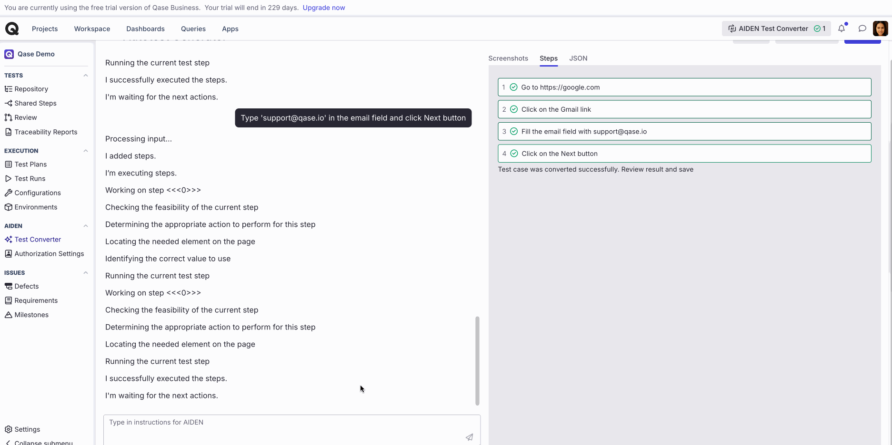

# AIDEN - QA Architect



Before reading this article, please check:

* ### [AIDEN - Test Advisor](broken-reference) 

While Manual testing has been the cornerstone of software quality for decades, it is slow, costly, and error-prone. And, traditional test automation requires deep technical expertise, extensive infrastructure, and ongoing maintenance — and these are barriers that prevent many teams from adopting it effectively.

AIDEN eliminates these challenges by allowing users to create, execute, and maintain automated tests using natural language instead of working with code.

By leveraging Generative AI, AIDEN transforms test descriptions into executable test scripts in Qase Cloud, runs them in parallel across multiple browsers.


With AIDEN, you can analyse your repository, generate automated test code from your manual test cases, and execute the tests in Qase Cloud.


e Cloud.

Advantages:

* No Coding Skills Required: Leverage powerful test automation without programming expertise.
* User-Friendly Interface: Simplified testing processes with an intuitive and accessible interface.
* Time Efficiency: Quickly convert manual tests to automated scripts with minimal effort.

***

## AIDEN - QA Architect 

Once our test cases have been analysed, we can proceed to automating them.

### a) Convert an existing Manual Test 

Open any test case, and click the 'Automate with AI' button to begin:

<figure><figcaption></figcaption></figure>

#### Adding the environment 

Your tests will run at a specific domain, so let's add the host environment:

<figure><figcaption></figcaption></figure>

If your host environment is not accessible from the public internet, you can help Qase tunnel to your private environment, here's a script that will help you set it up:

👉 [https://github.com/qase-tms/qase-frp](https://github.com/qase-tms/qase-frp)

<figure><figcaption></figcaption></figure>

#### Authorization 

Most of test cases generally require authorization as a precondition. You can add your authorization steps and use them when starting auto-test generation.

<figure><figcaption></figcaption></figure>

<figure><figcaption></figcaption></figure>

#### Generation 

You can monitor the status and view the test case that is being used for generation at the top.

<figure><figcaption></figcaption></figure>

The generator works by first breaking down your manual test case steps into proper actionable steps.

A 'Success' or 'Failure' message is displayed for each step, along with a screenshot to communicate progress.

<figure><figcaption></figcaption></figure>

#### Edit Steps 

If generation fails for a step, the status is updated as 'Error' and the particular steps with the problem will have the Error description.

<figure><figcaption></figcaption></figure>

You can help AIDEN by editing the particular step. Click 'Edit steps' and just correct the step text in natural language.

You can also delete steps that are not needed, or even edit steps that are successfully generated if you need to change something.

Click 'Regenerate' and AIDEN updates the steps. If you edit a step that is not generated yet, it will simply update the step's text.

If edits are made to a step that is already generated, it'll restart generation from that step.

#### Action Editor 

For scenarios where the error is a bit complicated, for example, if an element is not recognized as a button, you can use the JSON Action Editor to debug the step.

Follow the link below to understand how the action editor works.

👉 [https://help.qase.io/en/articles/10705702-guide-action-editor](https://help.qase.io/en/articles/10705702-guide-action-editor)

<figure><figcaption></figcaption></figure>

#### Notification widget 

If you navigate away, to a different page in the middle of the generation. You can always check the progress from AIDEN's notification widget.

If the generation is successful, you can find the test case from the "For Review" tab.

Generation can also be paused. There's a tab to view all the test cases that are paused previously.

<figure><figcaption></figcaption></figure>

#### Review and Save 

Once all test steps are successfully generated, the entire execution can be reviewed from the final step's attachment.

<figure><figcaption></figcaption></figure>

Click 'Save' to complete the generate and save the test case to the repository. You can differentiate this test case from the rest of the manual test cases with this symbol.

<figure><figcaption></figcaption></figure>

***

### b) Creating an auto-test from scratch 

To create a new automated test from scratch, start by selecting ‘AIDEN autotest’ from the ‘New test’ dropdown.

<figure><figcaption></figcaption></figure>

Start the conversation:

In this workflow, you interact with AIDEN using natural language. Simply tell AIDEN what to test, and it will translate your instructions into executable test steps.

<figure><figcaption></figcaption></figure>

Begin by providing the website or domain you want to test. For example, say: `let's test Google.com`

<figure><figcaption></figcaption></figure>

Define Your Steps:

AIDEN will break down your instructions into actionable steps and display visual feedback (screenshots) for each one. You can:

* Give simple actions like: “Click the ‘Gmail’ button”
* Or compound instructions like: “Enter ‘[support@qase.io](mailto:support@qase.io)’ in the search box, then click ‘Next’”

<figure><figcaption></figcaption></figure>

Each instruction is parsed and split into individual steps. As steps are generated, you’ll see both:

* A natural language summary of the action, as a step.
* A JSON block with selector and element type details

<figure><figcaption></figcaption></figure>

<figure><figcaption></figcaption></figure>

Deleting steps:

To delete a specific step, type for example: “Delete step 4”

<figure><figcaption></figcaption></figure>

***

After reading this article, please check:

* ### [AIDEN - Automation Engineer](https://help.qase.io/en/articles/11981749-aiden-automation-engineer) 
* ### [AIDEN - AI Test Cloud](https://help.qase.io/en/articles/11851804-aiden-ai-test-cloud) 
