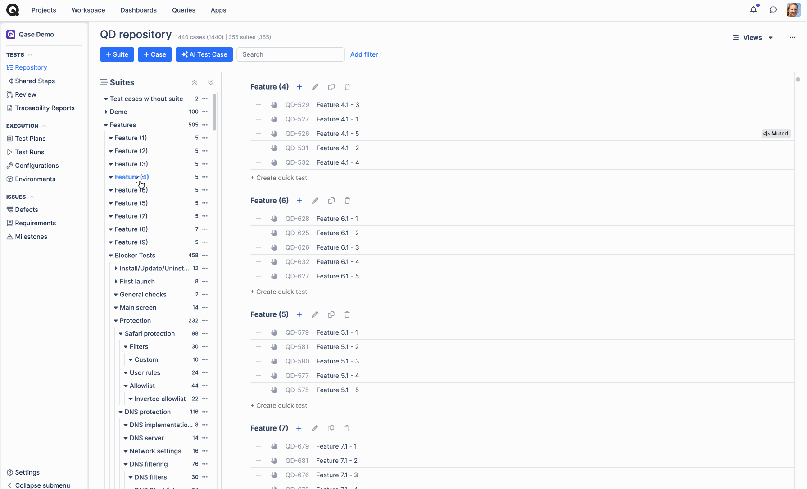

# Test suites



Test Suites are like containers for your Test Cases, letting you organize them by specific areas of testing. For example, in a Mobile game project, you need to test things like Background Music, User Interface, Performance, and Save Features. We'll create a separate Test Suite for each of these areas.

Since the project is new and doesn't have any suites or cases yet, you'll need to create your first suite by clicking the "+Suite" or "Create New Suite" buttons.

<figure><figcaption></figcaption></figure>

After clicking one of those buttons, a pop-up will appear where you need to fill in information about the suite.

<figure><figcaption></figcaption></figure>

* **Suite Name**:  Give your Test Suite a clear, descriptive name that shows what area or domain it covers. The Suite Name is the only required field when creating a Suite; the other fields are optional and can be filled in later or left empty.
* **Parent Suite**:  You can create a multi-level hierarchy of Test Suites. If your Suite is part of a larger group of testing scenarios, you can place it within a higher-level Parent Suite.
* **Description**:  Add details and context about which Test Cases should be included in the Test Suite.
* **Preconditions**:  Describe the steps that need to be completed before starting the Test Cases in the new Suite.

After creating one or more Test Suites, your Repository will now reflect how your Test Suites are structured and how they are related to each other.

<figure><figcaption></figcaption></figure>

## Suite Options 

If you hover your mouse over Test Suite while in Repository view, several controls will reveal itself:

* _**Collapse / Expand**:_ Clicking on the name of your test suite will either expand or collapse the suite:

<figure><figcaption></figcaption></figure>

* _**Create Case / Create Suite**:_ Clicking on the “+” icon opens up a menu with the options to “Create Suite” or “Create Case”:

<figure><figcaption></figcaption></figure>

* _**Edit Suite**:_ Clicking on the pencil icon allows you to edit the suite itself:

<figure><figcaption></figcaption></figure>

* _**Clone Suite**:_ Clicking on the two pages icon allows you to clone the suite. You also have the option to choose the project to which you would like the suite to be cloned to, the parent suite, the clone strategy, and the prefix, and you can choose to clone the suite with its children (suites and cases)

<figure><figcaption></figcaption></figure>

* _**Delete Suite**:_ Clicking on the trash can icon will allow you to delete the suite. Once you’ve deleted the suite, you will no longer be able to restore the suite from the “[Trash Bin](https://help.qase.io/en/articles/6628818-trash-bin)”:

<figure><figcaption></figcaption></figure>

## Views 

***

To navigate around your Suite structure easier, there are three Suite Tree layouts available, which you can toggle between using the “**Views**” dropdown in the top-right corner of the Repository:

<figure><figcaption></figcaption></figure>

### Nested Tree View 

***

The default layout - “Nested Tree View”, shows all the Suites you currently have in your project; you can open up the Suite Tree sidebar to navigate from one suite to another:

<figure><figcaption></figcaption></figure>

### Folder View 

***

The alternative "Folders view" layout displays only the Test Suite and Test Cases you are currently focusing on. To navigate to a different Suite, you need to select it from the sidebar.

This layout is a better solution for large structures with complex hierarchies.

<figure><figcaption></figcaption></figure>

When a parent suite is selected in folder view, both the test cases within this suite and its child suites are displayed in the main view.

<figure><figcaption></figcaption></figure>

### Mind Map view (Beta) 

***

This view displays all the suites and test cases within a project as a mind map. It also provides the option to create quick cases or suites by clicking on the “+” icon. You can alter the hierarchy of display by dragging the suite up or down. You can also move a test case from one suite to another. Additionally, clicking on the case will allow you to update its title.

<figure><figcaption></figcaption></figure>

Moreover, in both the Nested Tree view and the Folders view, you can click on the “...” menu icon to Edit, Close, Select and Unselect all, Create Suite, Create Case, and Delete.

<figure><figcaption></figcaption></figure>

